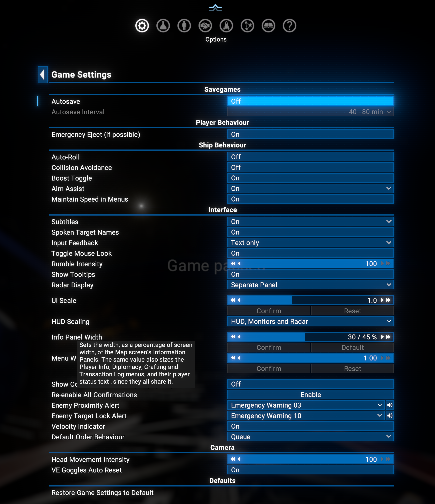
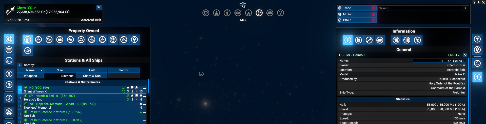
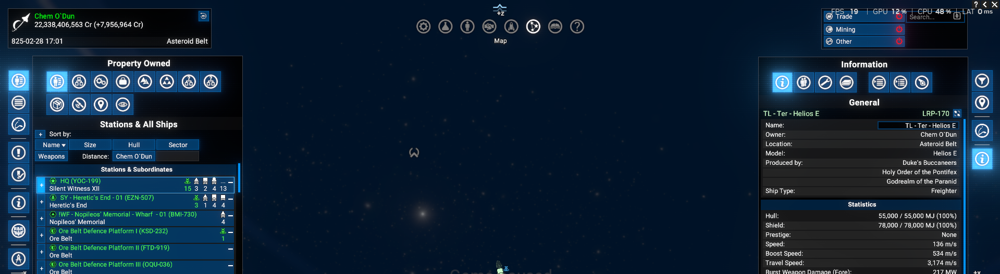
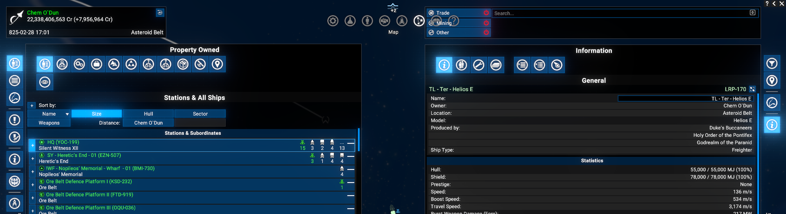
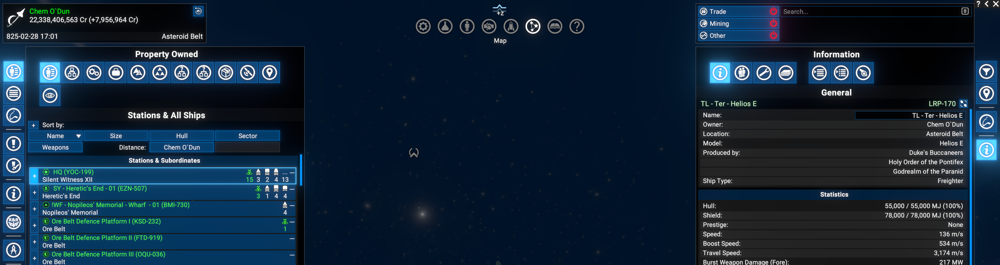
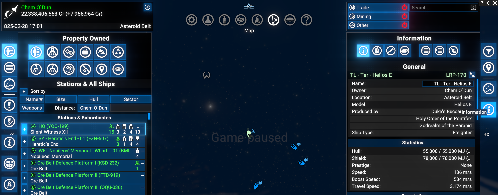
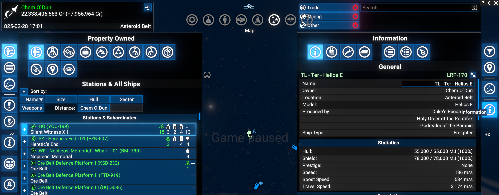

# Info Panel Width

Adds an Options menu slider to configure the width of the Map screen's Information Panels (also affects the Player Info, Diplomacy, Crafting and Transaction Log menus, which share the same value)

## Features

- By default, the game limits this width to at most 30% of your screen.
- This mod turns that old limit into the slider's new *dynamic minimum* and fixed *maximum* from menu width instead: the panels can now be made wider or narrower than the game ever allowed on their own, directly from Options > Game Settings (right after the "UI Scale" option).
- Because the game reuses this same width setting in a few other places, the slider affects those too, as a side effect:
  - The **Player Info** and **Diplomacy** screens' main panel (on the left side of the screen).
  - The **Transaction Log** screen's main panel (at the left edge of the screen).
  - The **Crafting** screen's whole window (centered on the screen).
  - The small **player status text** (your name, credits owed, current sector, play time) shown in the top-left corner of the Player Info, Diplomacy, Docked, Help, and Map screens - here there's no panel to resize, it just changes how much room that text has before it gets shortened.

## Limitations

- Take into account that most Information Panels have their own built-in minimum width limits and won't shrink past that point even if you set the slider all the way down.

## Requirements

- **X4: Foundations**: Version **8.00HF4** or higher and **UI Extensions and HUD**: Version **v8.0.4.10** or higher by [kuertee](https://next.nexusmods.com/profile/kuertee?gameId=2659).
  - Available on Nexus Mods: [UI Extensions and HUD](https://www.nexusmods.com/x4foundations/mods/552)
- **X4: Foundations**: Version **9.00** or higher and **UI Extensions and HUD**: Version **v9.0.0.7** or higher by [kuertee](https://next.nexusmods.com/profile/kuertee?gameId=2659).
  - Available on Nexus Mods: [UI Extensions and HUD](https://www.nexusmods.com/x4foundations/mods/552)
- **Print Extension List**: Version **1.00** or higher by [Chem O`Dun](https://next.nexusmods.com/profile/ChemODun/mods?gameId=2659).
  - Available on Steam: [Print Extension List](https://steamcommunity.com/sharedfiles/filedetails/?id=3770927339)
  - Available on Nexus Mods: [Print Extension List](https://www.nexusmods.com/x4foundations/mods/2191)

## Installation

- **Steam Workshop**: [Info Panel Width](https://steamcommunity.com/sharedfiles/filedetails/?id=3772202684) - only for **Game version 9.00** with latest Steam version of the `UI Extensions and HUD` mod.
- **Nexus Mods**: [Info Panel Width](https://www.nexusmods.com/x4foundations/mods/2264)

## Usage

Open the in-game Options menu, go to Game Settings, and use the new slider (right below "UI Scale") to set the width of the Map screen's Information Panels (and the other screens that share the same setting). Default: 30% of your screen width, the same as the game's original setting.

  

## Screenshots

- Full HD (1920x1080) - with 30% of screen width (default):

  

- Full HD (1920x1080) - with 17% of screen width (minimum):

  

- Full HD (1920x1080) - with 45% of screen width (maximum):

  

- 4K UHD (3840x2160) - with 30% of screen width (default):

  

- 4K UHD (3840x2160) - with 30% of screen width (default) and UI Scale set to 150% (in-game Options > Game Settings):

  

- 4K UHD (3840x2160) - with 40% of screen width (default) and UI Scale set to 150% (in-game Options > Game Settings):

  

## Credits

- Author: Chem O`Dun, on [Nexus Mods](https://next.nexusmods.com/profile/ChemODun/mods?gameId=2659) and [Steam Workshop](https://steamcommunity.com/id/chemodun/myworkshopfiles/?appid=392160)
- *"X4: Foundations"* is a trademark of [Egosoft](https://www.egosoft.com).

## Acknowledgements

- [EGOSOFT](https://www.egosoft.com) - for the X series.
- [kuertee](https://next.nexusmods.com/profile/kuertee?gameId=2659) - for the UI Extensions and HUD framework this mod hooks into.

## Changelog

### [1.01] - 2026-07-26

- Added
  - Initial public release.
